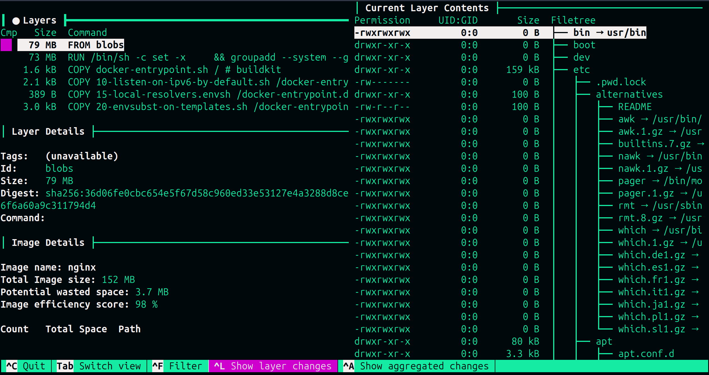

## Interactive Layer Exploration with Dive

`dive` is a powerful tool for visually exploring Docker image layers and analyzing what changes each layer makes.

### Launch Dive

Explore the Nginx image interactively:

```bash
dive nginx
```{{exec}}
### Understanding the Dive Interface

You will see an interactive terminal with multiple panels showing:

<p align="center">
  
</p>

### Interface Components

1. **Image Name** - Shows which image you're inspecting (`nginx:latest`)
2. **Total Image Size** - Complete size of the image (151.9 MB)
3. **Potential Wasted Space** - Duplicate or unnecessary files (2.1 MB)
4. **Image Efficiency Score** - How well optimized the image is (98%)
5. **Current Layer** - The layer you're currently viewing
6. **Previous Layer Details** - What files were added/removed/modified

